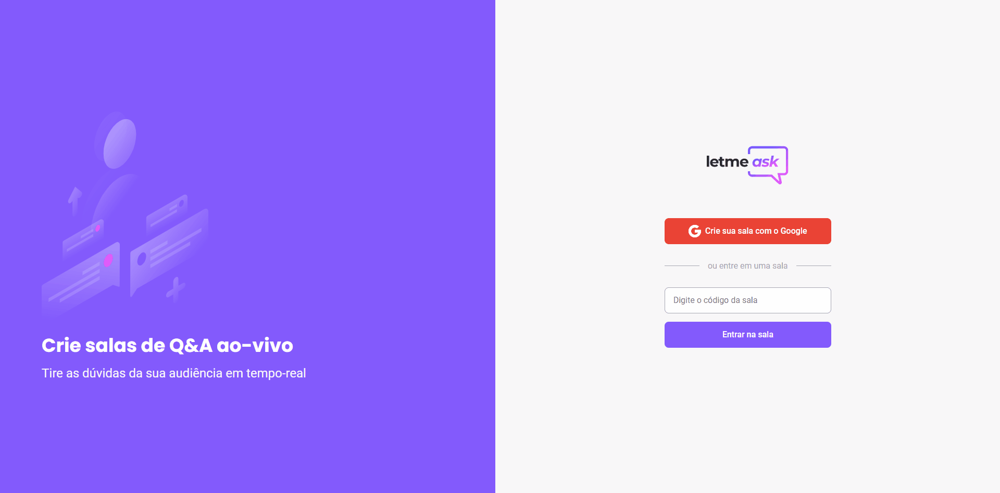

<div align="center">
  
</div>



---

# 👨‍🏫 Letmeask
> Uma aplicação web desenvolvida durante o Next Level Week Together. A motivação por trás desta aplicação foi desenvolvier um sistema de que gerenciasse dúvidas. Os usuários
autorizados possuem total liberdade para adicionar, curtir, remover, destacar uma dúvida, e até mesmo remover uma sala.

## 🧰 Tecnologias Utilizadas
- React.JS
- Typescript
- Firebase 
  - Utilizamos o Realtime Database para realizar o gerenciamento das dúvidas em tempo-real

## 🏃 Como rodar?
Clone o repositório com o seguinte comando:
```
$ git clone https://github.com/sou-gabriel/letmeask.git
```

Inicie o servidor local com:

```
$ yarn start 
```

--- 

<p align="center">Desenvolvido com ❤️ por Gabriel Ramos Nogueira</p>